# BitByte — System Architecture Deep Dive

> **BitByte** is a multi-tenant, QR-based food ordering platform. Restaurant owners generate QR codes per table; customers scan them to browse the menu and place orders in real-time. Owners manage everything through a live dashboard.

---

## Table of Contents

1. [High-Level Overview](#1-high-level-overview)
2. [Repository Structure](#2-repository-structure)
3. [Deployment Architecture](#3-deployment-architecture)
4. [Frontend — Next.js App Router](#4-frontend--nextjs-app-router)
5. [Backend — Express API Server](#5-backend--express-api-server)
6. [Data Layer — MongoDB](#6-data-layer--mongodb)
7. [Real-Time Layer — Socket.IO](#7-real-time-layer--socketio)
8. [Authentication Flow](#8-authentication-flow)
9. [Customer Order Flow (QR → Order → Kitchen)](#9-customer-order-flow-qr--order--kitchen)
10. [Owner Dashboard Flow](#10-owner-dashboard-flow)
11. [Analytics Pipeline](#11-analytics-pipeline)
12. [Caching Architecture](#12-caching-architecture)
13. [Security Model](#13-security-model)
14. [Environment Variables Reference](#14-environment-variables-reference)
15. [Key Design Decisions](#15-key-design-decisions)

---

## 1. High-Level Overview

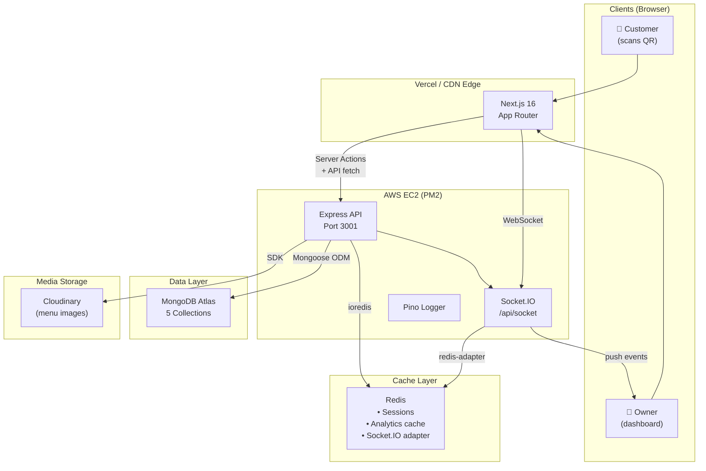

---

## 2. Repository Structure

```
gamma/                          ← Monorepo root
│
├── client/                     ← Next.js 16 Frontend
│   ├── app/                    ← App Router pages & layouts
│   │   ├── auth/signin/        ← Login page
│   │   ├── onboarding/         ← Post-signup restaurant setup
│   │   ├── dashboard/          ← Owner dashboard (auth-protected)
│   │   │   ├── menu/           ← Menu item CRUD
│   │   │   ├── orders/         ← Live order management
│   │   │   ├── tables/         ← Table + QR code manager
│   │   │   ├── analytics/      ← Revenue & item analytics
│   │   │   └── profile/        ← Restaurant settings
│   │   ├── table/
│   │   │   └── [restaurantId]/
│   │   │       └── [tableId]/  ← Customer menu page (public)
│   │   │           └── order-status/ ← Customer order tracker
│   │   └── actions/            ← Next.js Server Actions
│   │       ├── auth.ts         ← signIn / signUp
│   │       └── order.ts        ← createOrder / updateStatus
│   ├── components/
│   │   ├── customer/           ← CustomerMenu, Cart components
│   │   ├── dashboard/          ← Dashboard layout, nav
│   │   └── ui/                 ← Button, Modal, shared UI kit
│   ├── lib/
│   │   ├── auth.ts             ← NextAuth v5 configuration
│   │   ├── auth.config.ts      ← JWT callbacks (restaurantId injection)
│   │   ├── db.ts               ← MongoDB connection (maxPool: 1)
│   │   ├── api.ts              ← apiFetch() — cookie-forwarding helper
│   │   ├── session.ts          ← Anonymous customer session (localStorage)
│   │   └── socket.ts           ← Socket.IO client singleton
│   ├── hooks/
│   │   └── useSocket.ts        ← React hook for Socket.IO subscription
│   └── models/                 ← Shared Mongoose schema (mirrors server/)
│
├── server/                     ← Express API Backend
│   ├── index.ts                ← App entrypoint, middleware wiring
│   ├── controllers/            ← Request handlers (thin, delegate to services)
│   │   ├── AuthController.ts
│   │   ├── MenuController.ts
│   │   ├── OrderController.ts
│   │   ├── RestaurantController.ts
│   │   ├── TableController.ts
│   │   ├── AnalyticsController.ts
│   │   └── UploadController.ts
│   ├── services/               ← Business logic layer
│   │   ├── OrderService.ts     ← Price validation, order creation
│   │   ├── MenuService.ts      ← Item upsert, category normalization
│   │   └── TenantService.ts    ← Restaurant lookup by slug
│   ├── routes/                 ← Express Router definitions
│   ├── middleware/
│   │   ├── auth.ts             ← JWT decode → req.user
│   │   ├── cors.ts             ← Env-driven CORS allowlist
│   │   ├── rateLimiter.ts      ← express-rate-limit (3 profiles)
│   │   └── requestLogger.ts    ← pino-http HTTP logging
│   ├── models/                 ← Mongoose schemas (source of truth)
│   ├── lib/
│   │   ├── db.ts               ← MongoDB connection (maxPool: 10)
│   │   ├── redis.ts            ← ioredis singleton
│   │   ├── logger.ts           ← pino structured logger
│   │   └── qrcode.ts           ← QR data-URL generator
│   ├── socket/
│   │   └── index.ts            ← Socket.IO init + Redis adapter
│   └── types/
│       └── express.d.ts        ← AuthenticatedUser type augmentation
│
├── ecosystem.config.cjs        ← PM2 production config
├── package.json                ← Monorepo scripts
└── .env.local                  ← Shared environment variables
```

---

## 3. Deployment Architecture

### Development Mode (Split, 2 processes)

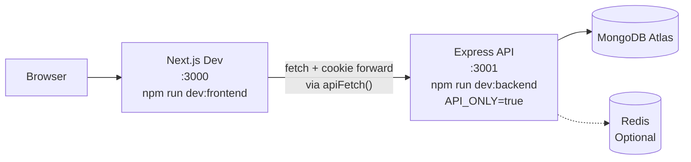

### Production Mode (Unified, 1 process on EC2)

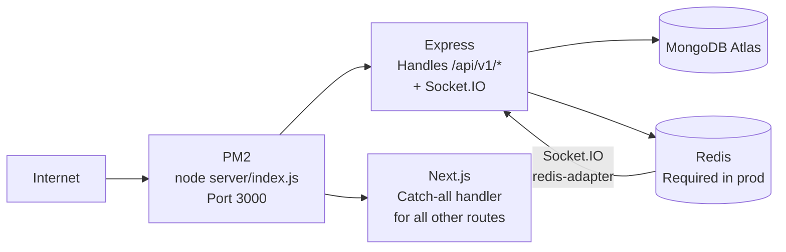

> In production, Express boots first, attaches Socket.IO, then hands all non-API routes to the Next.js request handler. This avoids running two separate Node processes.

---

## 4. Frontend — Next.js App Router

### Route Map

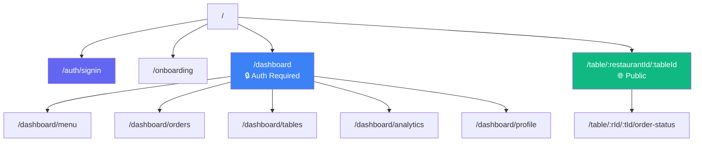

### Server vs Client Components

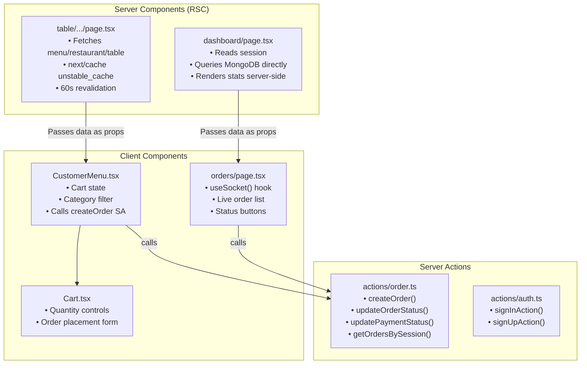

### Data Fetching Strategy

| Page | Strategy | Why |
|------|----------|-----|
| `/dashboard` | Direct MongoDB via Mongoose (RSC) | Auth-gated, always fresh |
| `/dashboard/orders` | `apiFetch()` Server Action → Express | Needs auth cookie forwarding |
| `/table/:id/:id` | `unstable_cache` → Express REST | Public, cacheable 60s |
| `/dashboard/analytics` | `apiFetch()` Server Action → Express | Complex aggregations, Redis cached |

---

## 5. Backend — Express API Server

### Middleware Stack (request pipeline)

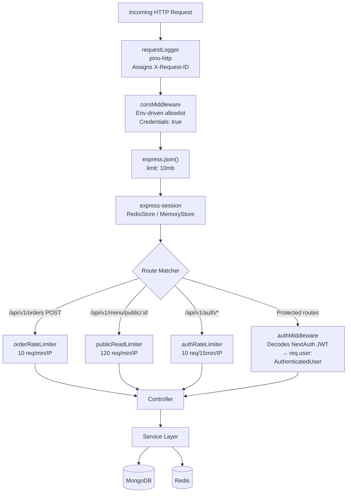

### API Endpoints

```
POST   /api/v1/auth/signup              ← Create owner account + restaurant
POST   /api/v1/auth/verify              ← Validate credentials (NextAuth callback)

GET    /api/v1/restaurant               ← Owner: get restaurant profile
PUT    /api/v1/restaurant               ← Owner: update profile/branding

GET    /api/v1/menu                     ← Owner: all items
POST   /api/v1/menu                     ← Owner: create item
PUT    /api/v1/menu/:id                 ← Owner: update item
DELETE /api/v1/menu/:id                 ← Owner: delete item
PATCH  /api/v1/menu/:id/toggle          ← Owner: toggle availability
GET    /api/v1/menu/public/:restaurantId← Public: customer menu (cached)

GET    /api/v1/tables                   ← Owner: all tables
POST   /api/v1/tables                   ← Owner: create table + gen QR
DELETE /api/v1/tables/:id               ← Owner: delete table
PATCH  /api/v1/tables/:id/toggle        ← Owner: activate/deactivate
GET    /api/v1/tables/public/:id        ← Public: table info for customer

GET    /api/v1/orders                   ← Owner: recent orders (paginated)
POST   /api/v1/orders                   ← Public: customer places order
GET    /api/v1/orders/by-session        ← Public: customer order tracker
PATCH  /api/v1/orders/:id/status        ← Owner: update order status
PATCH  /api/v1/orders/:id/payment       ← Owner: mark order paid

GET    /api/v1/analytics/metrics        ← Owner: revenue + top items (cached)
GET    /api/v1/analytics/associations   ← Owner: "bought together" (cached)

POST   /api/v1/upload                   ← Owner: upload image to Cloudinary

GET    /api/health                      ← Health check (no logging)
```

### Controller → Service → Model Layering

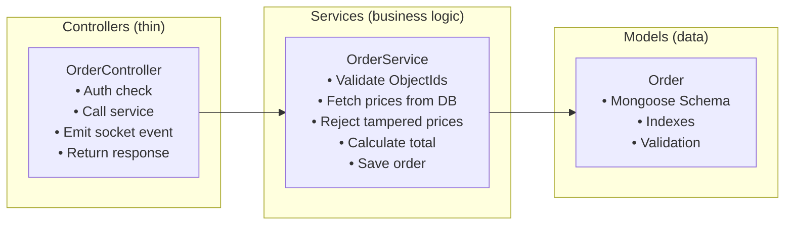

---

## 6. Data Layer — MongoDB

### Collections & Schema Relationships

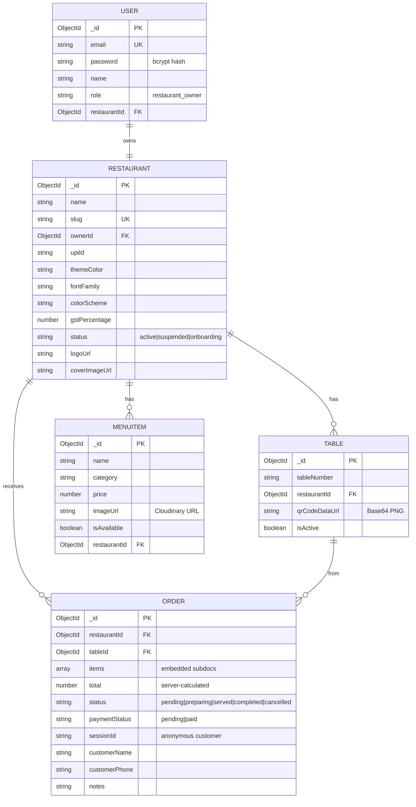

### MongoDB Indexes

| Collection | Index | Purpose |
|-----------|-------|---------|
| Restaurant | `slug` unique | Lookup by URL slug |
| Restaurant | `customDomain` sparse unique | Custom domain routing |
| MenuItem | `{ restaurantId, category }` | Filtered menu fetch |
| MenuItem | `{ restaurantId, isAvailable }` | Public menu (available only) |
| Table | `{ restaurantId, tableNumber }` unique | Duplicate prevention |
| Order | `{ restaurantId, createdAt: -1 }` | Dashboard order list |
| Order | `{ tableId, createdAt: -1 }` | Per-table order history |
| Order | `{ sessionId, tableId }` **compound** | Customer order status lookup |
| Order | `{ status, restaurantId }` | Status filter queries |
| Order | `{ restaurantId, status, createdAt: -1 }` | Analytics aggregations |

---

## 7. Real-Time Layer — Socket.IO

### Event Architecture

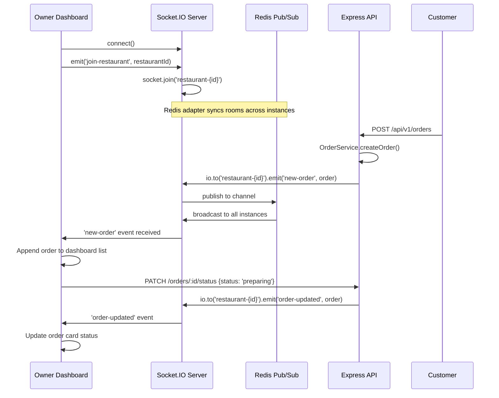

### Multi-Instance Socket.IO (with Redis Adapter)

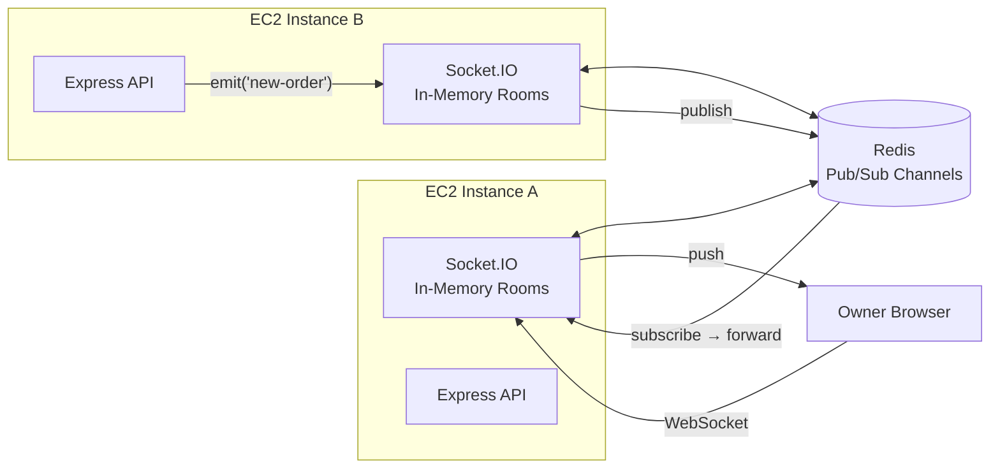

> Without the Redis adapter, if the Owner's browser is connected to Instance A but the order hits Instance B, the owner would **never see** the real-time notification.

---

## 8. Authentication Flow

### Owner Login (NextAuth v5 + JWT)

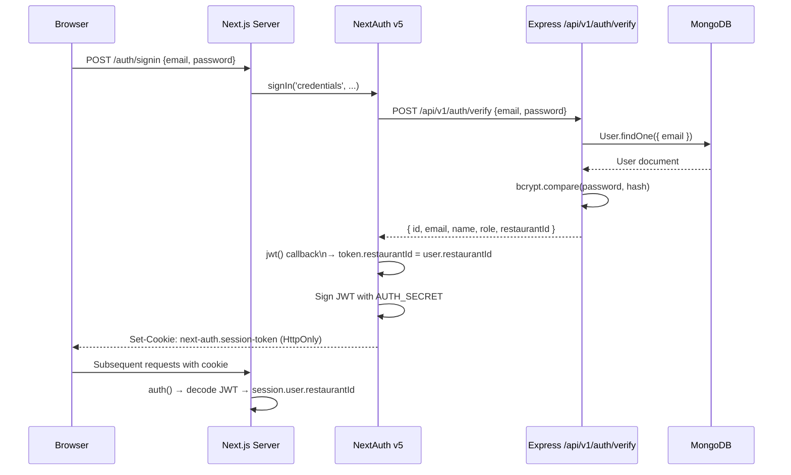

### Express API Auth (Server Actions → Express)

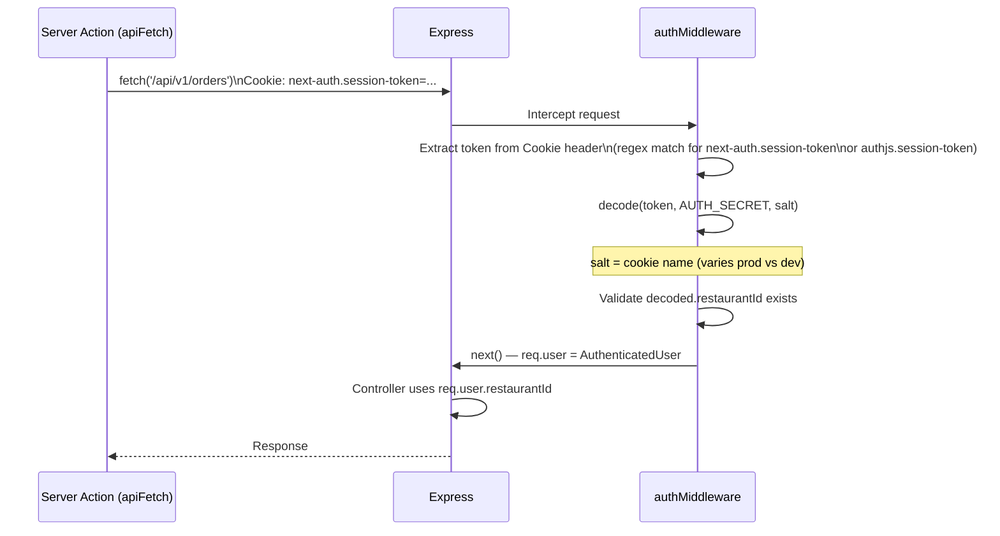

### Anonymous Customer Session

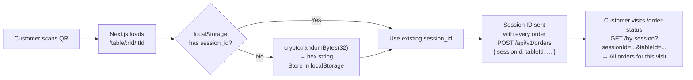

---

## 9. Customer Order Flow (QR → Order → Kitchen)

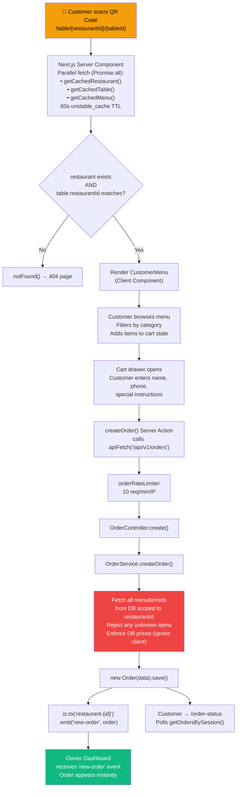

---

## 10. Owner Dashboard Flow

### Order Lifecycle Management

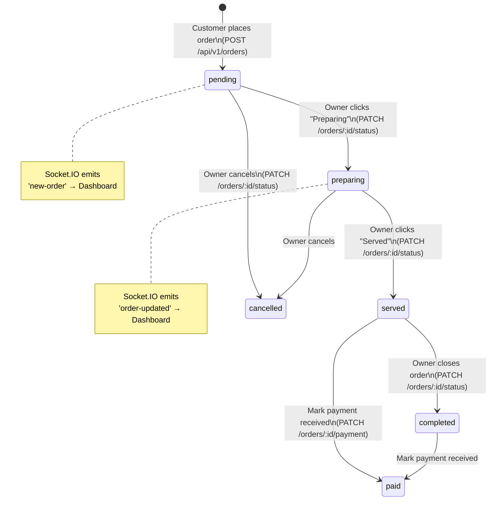

### Dashboard Data Flow

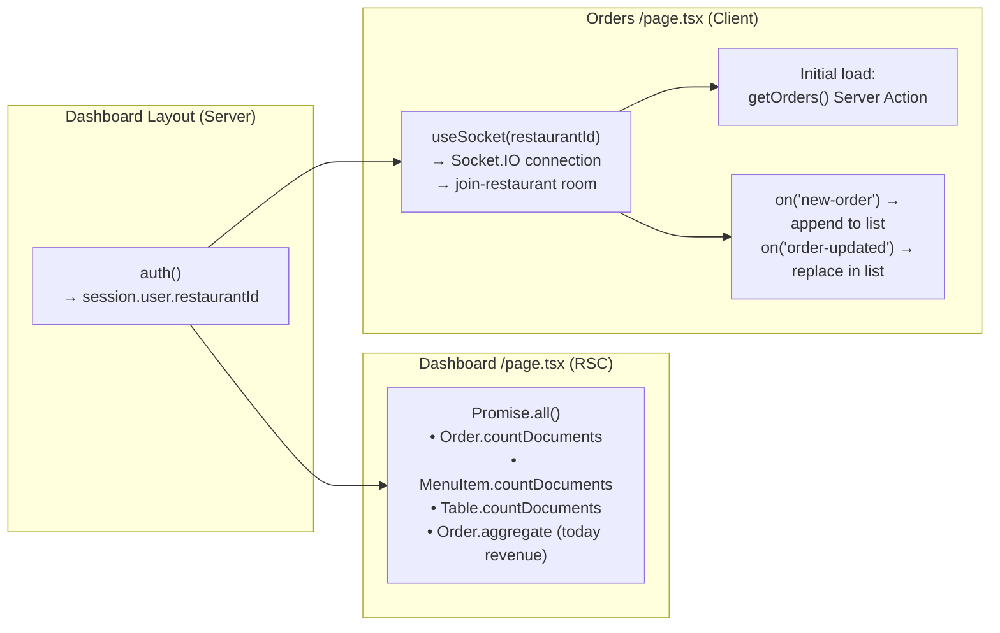

---

## 11. Analytics Pipeline

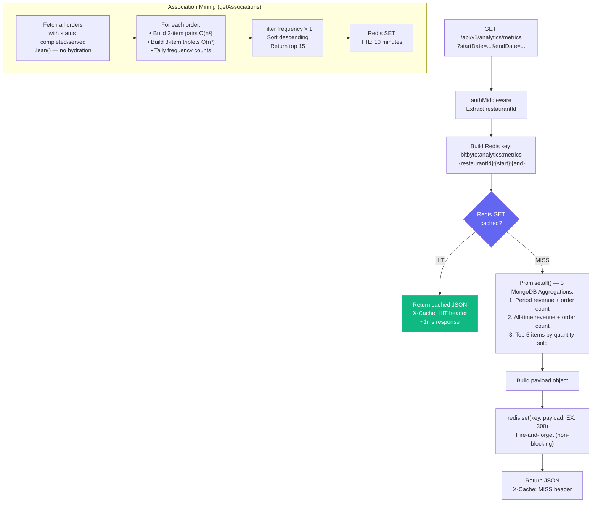

---

## 12. Caching Architecture

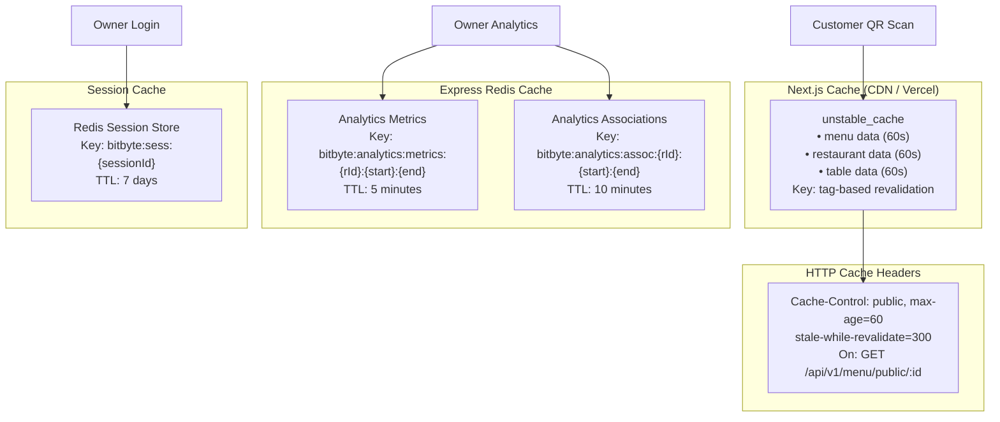

### Cache Invalidation Strategy

| Cache | Invalidation Trigger |
|-------|---------------------|
| `unstable_cache` menu | Tag `menu-{restaurantId}` — revalidated on menu CRUD via `revalidateTag()` |
| Analytics Redis | Time-based TTL expiry (no explicit invalidation) |
| HTTP `Cache-Control` | Browser/CDN obeys `max-age=60`; Cloudflare can be purged manually |
| Session Redis | 7-day TTL; destroyed on explicit signOut |

---

## 13. Security Model

### Multi-Tenant Isolation

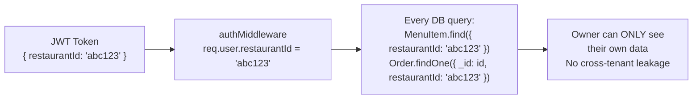

### Price Tampering Prevention

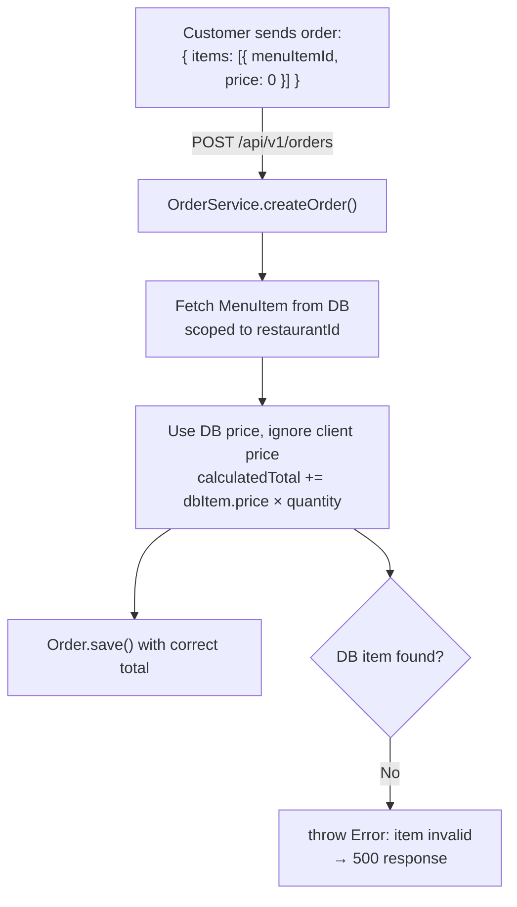

### Rate Limiting Profiles

| Profile | Routes | Limit | Window |
|---------|--------|-------|--------|
| `authRateLimiter` | `/auth/signup`, `/auth/verify` | 10 req | 15 min |
| `orderRateLimiter` | `POST /orders` | 10 req | 1 min |
| `publicReadLimiter` | `/menu/public/*`, `/orders/by-session` | 120 req | 1 min |

### CORS Policy

```mermaid
flowchart LR
    REQ["Incoming Request\nOrigin: https://mybistro.com"] --> MW["corsMiddleware"]
    MW --> CHECK{"origin in\nallowed list?"}
    CHECK -- "Yes" --> ALLOW["Access-Control-Allow-Origin: https://mybistro.com\nAccess-Control-Allow-Credentials: true"]
    CHECK -- "No" --> DENY["Access-Control-Allow-Origin: null\n(browser blocks response)"]
    CHECK -- "No origin header\n(server-to-server)" --> OPEN["Access-Control-Allow-Origin: *"]
```

Allowed origins: `NEXTAUTH_URL`, `NEXT_PUBLIC_BASE_URL`, `NEXT_PUBLIC_APP_URL`, plus localhost variants in development.

---

## 14. Environment Variables Reference

| Variable | Used By | Required | Purpose |
|----------|---------|----------|---------|
| `MONGODB_URI` | Server + Client | ✅ | MongoDB Atlas connection string |
| `AUTH_SECRET` | Server + Client | ✅ | NextAuth JWT signing key |
| `NEXTAUTH_SECRET` | Client | ✅ | NextAuth fallback secret |
| `NEXTAUTH_URL` | Client | ✅ | App base URL (NextAuth callbacks) |
| `NEXT_PUBLIC_BACKEND_URL` | Client | ✅ prod | Express API URL (e.g. `https://api.bistro.com`) |
| `NEXT_PUBLIC_BASE_URL` | Server | ✅ | QR code URL base (e.g. `https://bistro.com`) |
| `REDIS_URL` | Server | ✅ prod | Redis connection (sessions + analytics cache) |
| `CLOUDINARY_CLOUD_NAME` | Server | ✅ | Cloudinary account |
| `CLOUDINARY_API_KEY` | Server | ✅ | Cloudinary API key |
| `CLOUDINARY_API_SECRET` | Server | ✅ | Cloudinary API secret |
| `SIGNUP_SECRET_KEY` | Server | ✅ | Gate for new restaurant signups |
| `LOG_LEVEL` | Server | ❌ | Pino log level (default: `info` in prod, `debug` in dev) |
| `PORT` | Server | ❌ | Express port (default: `3000`) |
| `NODE_ENV` | Both | ❌ | `production` / `development` |
| `API_ONLY` | Server | ❌ | `true` = skip Next.js handler (split mode) |

---

## 15. Key Design Decisions

### Why Express + Next.js together (not Next.js API routes)?

Next.js API routes run in a **serverless/edge** environment where persistent connections (Socket.IO, long-lived Redis pub/sub) are impossible. Express owns the HTTP server, allowing Socket.IO to attach to it directly. Next.js is then used as a rendering engine, not as an API server.

### Why MongoDB over PostgreSQL?

Menu items and orders have variable-length embedded arrays (items, modifiers) that map naturally to MongoDB documents. The restaurant customisation schema (theme, fonts, GST config) changes per tenant without requiring schema migrations.

### Why anonymous sessions (localStorage) for customers?

Customers should not need an account to order food. The `sessionId` generated on first QR scan ties their orders together for the duration of the visit. No PII collection required, no login friction.

### Why Redis is optional in development but required in production?

In development you rarely have Redis available locally. The fallback to `MemoryStore` is acceptable for single-developer testing. In production, `MemoryStore` grows unboundedly and is cleared on every restart — Redis is enforced via a startup assertion.

### Why `maxPoolSize: 10` on Express but `1` on Next.js?

Express handles many concurrent HTTP requests — it needs multiple DB connections in the pool to serve them in parallel. Next.js in the App Router invokes each Server Component as a relatively short-lived serverless-style function — a pool of 1 (with caching) prevents connection exhaustion on Vercel or serverless deployments.
