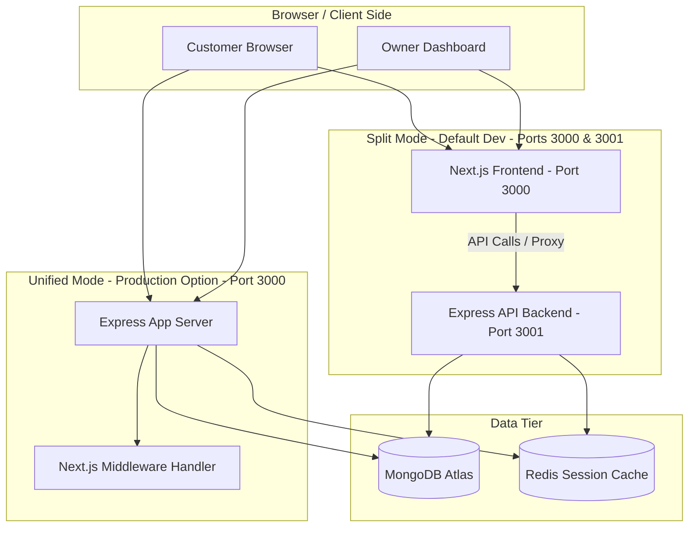

# BitByte local development and architecture guide

Welcome to the **BitByte** developer documentation. This guide details the architecture of our split-structure repository (Express backend + Next.js frontend), outlines the steps to run them locally, explains all available NPM scripts, and provides troubleshooting steps for common development issues.

---

## 1. System Architecture

The BitByte codebase is structured as a monorepo consisting of two primary components:
- **Backend (`/server`):** An Express application written in TypeScript that manages database connections, HTTP API endpoints (orders, tables, menus, analytics, uploads), WebSockets (via Socket.io) for real-time order notifications, and optional Redis session storage.
- **Frontend (`/client`):** A Next.js application using the App Router, handling the Customer Menu interface, Owner Dashboard, NextAuth v5 session authentication, and Server Actions.

### Architecture Modes

The codebase is designed to run in two distinct modes:



#### A. Split Mode (Default Development Environment)
The Express backend runs as a pure API server on port `3001`, while the Next.js frontend runs independently on port `3000`. Next.js communicates with the Express backend using API requests.
* **Benefits:** Isolation of logs, faster live-reloading/hot-module-replacement, and standard Next.js dev server experience.

#### B. Unified Mode (Production Deployments)
A single Express server acts as the primary process on port `3000`. It processes Express routes (`/api/v1/*`, etc.), boots socket connections, and feeds all catch-all web requests directly to the Next.js compilation/rendering middleware.
* **Benefits:** Fits inside single-container hosting environments (e.g. Render, Heroku, AWS ECS) and conserves RAM by avoiding multiple Node runtimes.

---

## 2. Prerequisites

Ensure you have the following installed on your system:
- **Node.js:** `v20.x` or higher (tested with Node v24)
- **NPM:** `v10.x` or higher
- **MongoDB:** An active MongoDB Atlas cluster or a local MongoDB database instance
- **Redis (Optional):** Used for session cache. If `REDIS_URL` is omitted, the application automatically falls back to an in-memory session store.

---

## 3. Environment Variables Configuration

Create a `.env.local` file in the **root** of the repository. This single file is shared between the frontend and the backend.

```env
# MongoDB Connection URI (Use direct connection string on macOS to bypass DNS SRV lookups)
MONGODB_URI=mongodb://<username>:<password>@<mongodb-host>:27017/<database>?authSource=admin&tls=true&retryWrites=true&w=majority

# NextAuth Secrets (Generate a secure random key for production)
NEXTAUTH_SECRET=your-secret-key-change-this-in-production
AUTH_SECRET=your-secret-key-change-this-in-production

# NextAuth callback base URL
NEXTAUTH_URL=http://localhost:3000

# Cloudinary Configuration (For menu item image uploads)
CLOUDINARY_CLOUD_NAME=your_cloud_name
CLOUDINARY_API_KEY=your_api_key
CLOUDINARY_API_SECRET=your_api_secret

# Base URL for Customer QR Code Generation
NEXT_PUBLIC_BASE_URL=http://localhost:3000

# Restaurant Owner Registration Secret Key
SIGNUP_SECRET_KEY=gamma-secret-2026

# Redis Connection URL (Optional, comment out to use in-memory sessions)
# REDIS_URL=redis://localhost:6379
```

---

## 4. Installation

To install all dependencies for both client and server, run the following command in the project root:

```bash
npm install
```

---

## 5. Development & Production Run Scripts

All scripts are executed from the root folder. The following table describes the functionality of each script:

| Script Name | Command | Description |
| :--- | :--- | :--- |
| **`npm run dev`** | `concurrently "npm run dev:backend" "npm run dev:frontend"` | Starts the backend server and frontend server concurrently in **Split Mode**. |
| **`npm run dev:backend`** | `API_ONLY=true PORT=3001 tsx server/index.ts` | Starts the Express API server on port `3001` in API-Only mode. Uses `tsx` for on-the-fly TS compilation. |
| **`npm run dev:frontend`** | `next dev client -p 3000` | Starts the Next.js development server on port `3000`. |
| **`npm run build:client`** | `next build client` | Compiles the Next.js frontend application for production. |
| **`npm run build:server`** | `tsc -p server/tsconfig.json` | Compiles the TypeScript backend files into javascript (`.js` files inline in the `/server` folder). |
| **`npm run start`** | `concurrently "npm run start:backend" "npm run start:frontend"` | Runs frontend and backend concurrently in **production split mode**. |
| **`npm run start:backend`** | `API_ONLY=true PORT=3001 NODE_ENV=production node server/index.js` | Runs the compiled Express API server on port `3001` in production mode. |
| **`npm run start:frontend`** | `next start client -p 3000` | Starts the Next.js production server on port `3000`. |
| **`npm run lint`** | `next lint client` | Lints the frontend application codebase. |

---

## 6. Accessing the Application

Once the development server is running (`npm run dev`):
- **Restaurant Owner Dashboard:** [http://localhost:3000/dashboard](http://localhost:3000/dashboard)
- **Customer QR Code Menu landing:** [http://localhost:3000/table/[restaurantId]/[tableId]](http://localhost:3000/table/[restaurantId]/[tableId])
- **Backend API Health Check:** [http://localhost:3001/api/health](http://localhost:3001/api/health)

---

## 7. Troubleshooting & Important Workarounds

### A. macOS DNS Resolution Issue (`querySrv ECONNREFUSED`)
On macOS, Node.js c-ares DNS resolver defaults to local servers, which frequently fails to resolve MongoDB Atlas SRV connection strings (`mongodb+srv://...`). 

#### The Solution:
1. **Fallback hook in code:** The project implements a DNS workaround in `client/instrumentation.ts` and `server/lib/db.ts` which programmatically updates dns servers:
   ```typescript
   dns.setServers(['8.8.8.8', '1.1.1.1']);
   ```
2. **Direct connection URI:** If SRV errors persist in Next.js Turbopack worker threads, configure the `MONGODB_URI` using a direct `mongodb://` replica set connection string (with port `27017` and explicit shard list) instead of `mongodb+srv://`. This avoids SRV lookups entirely.

### B. Cleaning Stuck Ports (Address Already In Use)
If you exit the dev server abruptly, the ports `3000` or `3001` might remain bound. Run the following command to force-kill any processes occupying these ports:

```bash
kill -9 $(lsof -t -i:3000 -i:3001)
```

Alternatively, to find the specific PID running on a port:
```bash
lsof -i :3000
lsof -i :3001
```
Then run:
```bash
kill -9 <PID_NUMBER>
```

---

## 8. Monorepo Project Structure

```
├── client/                 # Next.js Frontend Application
│   ├── app/                # App Router files (routes, layouts, API endpoints, Server Actions)
│   ├── components/         # Reusable React components (UI kit, layout wrappers, specific widgets)
│   ├── hooks/              # Custom React hooks (sockets, state sync)
│   ├── lib/                # Client-side utility functions & NextAuth config
│   ├── public/             # Static assets (images, logos, SVGs)
│   ├── styles/             # Global CSS and Tailwind stylesheet imports
│   ├── instrumentation.ts  # Next.js system hooks (dns fallback configuration)
│   └── tsconfig.json       # Next.js Typescript config
│
├── server/                 # Express API Backend Application
│   ├── controllers/        # Route controllers managing business logic (Orders, Analytics, Restaurant info)
│   ├── lib/                # Shared logic (Mongoose setup, Redis clients, socket.io namespaces)
│   ├── middleware/         # Express middlewares (CORS settings, NextAuth session validation)
│   ├── models/             # Mongoose schemas (User, Order, MenuItem, Restaurant, Table)
│   ├── routes/             # Express routing definitions mapped to controllers
│   ├── services/           # Underlying business validation logic
│   ├── index.ts            # Main backend server startup file
│   └── tsconfig.json       # Backend TypeScript compiler settings
│
├── .env.local              # Root environment configurations
├── package.json            # Unified scripts & monorepo dependencies configuration
└── ecosystem.config.cjs    # PM2 Process Manager configuration
```

---

## 9. Production Deployments with PM2

For production deployments on VPS environments (e.g. AWS EC2, DigitalOcean Droplet), PM2 can manage the unified Express + Next.js server instance using the `ecosystem.config.cjs` configuration.

To build the packages and start the application via PM2:

```bash
# 1. Compile client assets and backend files
npm run build:client
npm run build:server

# 2. Run the process under PM2
pm2 start ecosystem.config.cjs
```
This spawns a single process running in **Unified Mode** on port `3000`, matching RAM constraints and offering automatic restarts in case of exceptions or memory threshold breaches.
